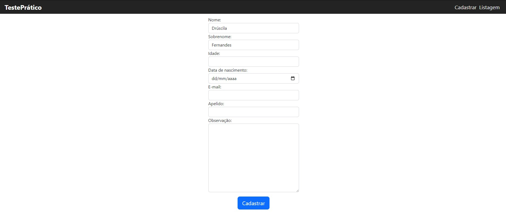
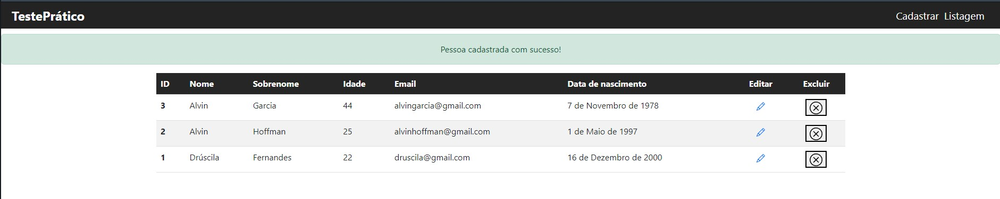
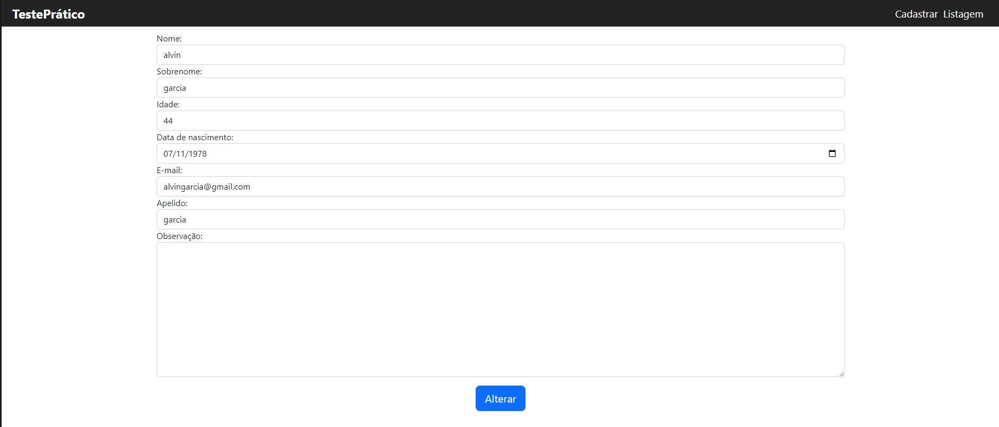
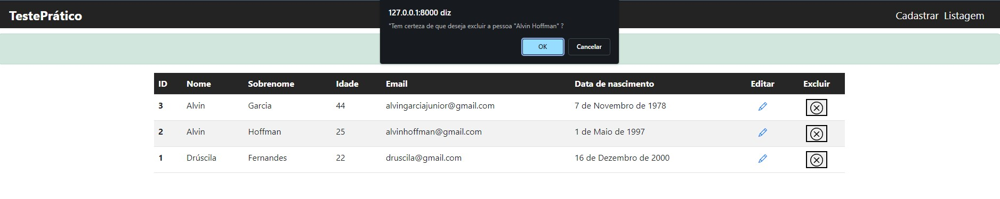
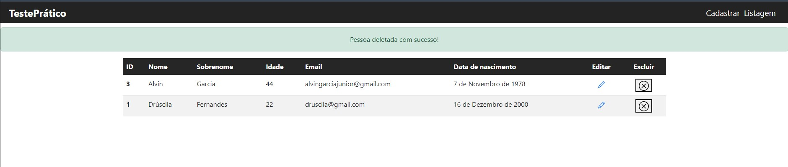
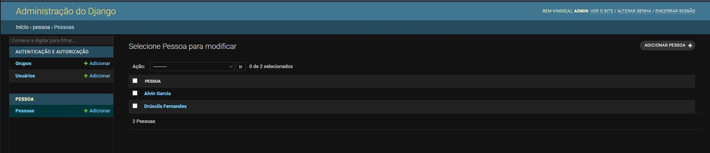
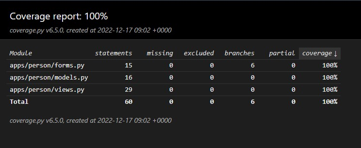

<p align="center">
  <a href="https://www.djangoproject.com" target="blank"></a>
</p>

<p align="center">
  <a href="#-tecnologias">Tecnologias</a>&nbsp;&nbsp;&nbsp;|&nbsp;&nbsp;&nbsp;
  <a href="#-projeto">Projeto</a>&nbsp;&nbsp;&nbsp;|&nbsp;&nbsp;&nbsp;
  <a href="#-como-executar">Como executar</a>
</p>


<hr>

<a id="-tecnologias"></a>

## Tecnologias

Esse projeto foi desenvolvido com as seguintes tecnologias:


<hr>

<a id="-projeto"></a>

## 💻 Projeto

O projeto a seguir é referente a um teste prático. 

Esclarecimentos:
- A escolha de usar CBV(Class-Based Views) para esse projeto foi devido a rápida implementação e ganho no momento de testar.
- A escolha do SQLite foi motivada pela baixa dependência no caso de teste da aplicação.
- No que se refere aos requisitos poucas coisas estão diferentes, entre elas: Email como campo único, funcionalidade de exclusão de pessoa e cobertura de testes.


<p align="center">
  
</p>

<p align="center">
  
</p>

<p align="center">
  
</p>

<p align="center">
  
</p>

<p align="center">
  
</p>

<p align="center">
  
</p>

<p align="center">
  
</p>

<a id="-como-executar"></a>

## 🚀 Como executar

### 💻 Pré-requisitos
 **Antes de começar, verifique se você atendeu aos seguintes requisitos:**

- Você tem uma máquina `< Windows / Linux / Mac >`.

- Você tem python na versão 3.11 ou superior instalado em sua máquina.

- clone ou baixe o repositório.

## Com o ambiente virtual ativo:

### Como instalar localmente (Sem dependências de desenvolvimento):

- Acesse a pasta do projeto no terminal execute:

```console
cd app
cp env .env
pip install -r requirements.txt
poetry install
```

### Como instalar localmente (Com dependências de desenvolvimento):

```console
cd app
cp env .env
pip install -r requirements-dev.txt
poetry install
```

**OBS. Não se esqueça de alterar o arquivo .env que foi gerado a partida da cópia de exemplo "env" que vem na raíz do projeto.**


### A aplicação já vem com um super usuário para acessar a parte administrativa do django 
```
  Usuário: admin
  Senha: 123456
```

## 👨‍💻 Ativando a aplicação
Para executar o servidor localmente (Com o ambiente virtual ativo):

```console
python manage.py runserver
```

Agora é possível acessar a aplicação em http://localhost:8000/

E o painel administrativo em http://localhost:8000/admin

## 👨‍💻 Caso queira executar os testes basta ter instalado as dependências de desenvolvimento e executar:

```console
coverage run -m pytest
coverage html
python -m http.server 9000 --directory htmlcov
```

Agora é possível acessar a cobertura de testes em http://localhost:9000/